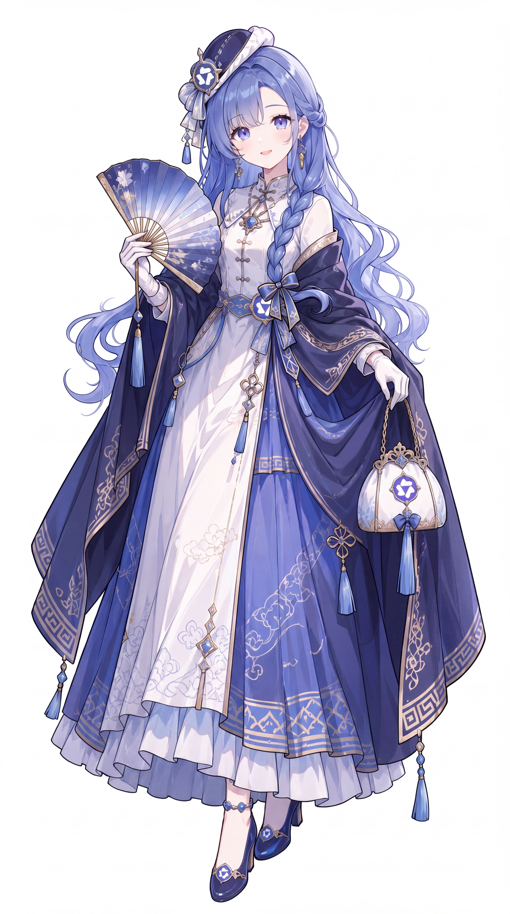
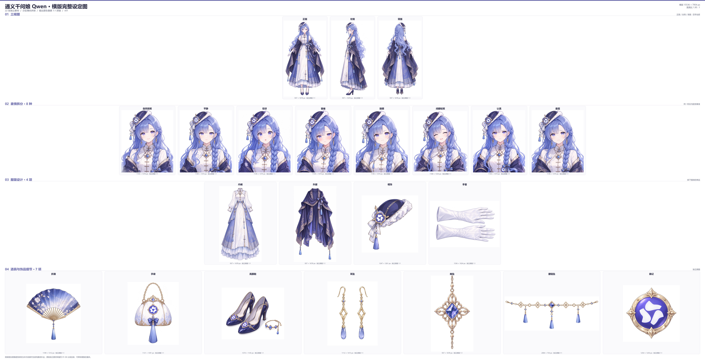
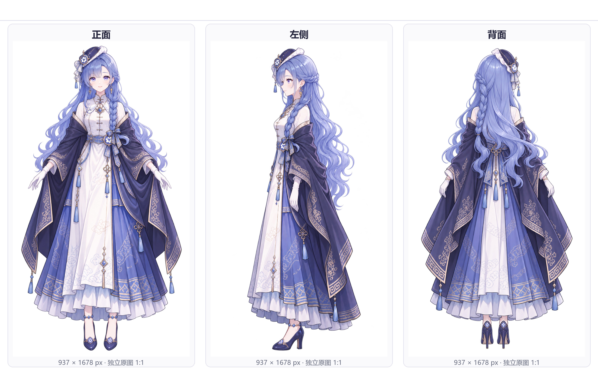
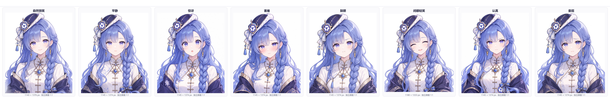
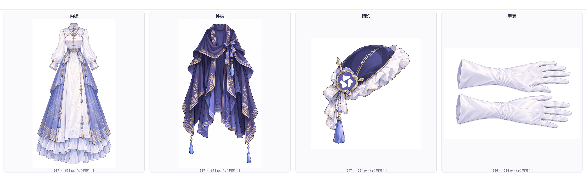
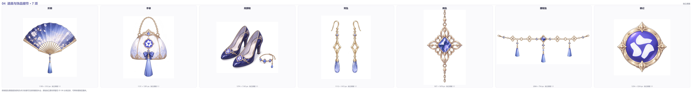

# AI 娘 · 横版完整设定图补全

把 ZipZipPipe 创作的 AI 娘角色立绘，逐张拆解成三视图、表情、服装与道具细节等独立素材。
原图只有正面的角色，用本机图像模型补出侧面与背面，再按原生像素 1:1 拼成一张横版完整设定图。

角色形象与设定来自 ZipZipPipe，本仓库做的是设定图补全。

## 一张参考图能补出什么

以通义千问娘 Qwen 为例。左边是原作者的原始立绘，右边是补全后的横版完整设定图。

<table>
<tr>
<td width="50%">

**原作者原始立绘（唯一输入）**



</td>
<td width="50%">

**补全后的横版完整设定图**



</td>
</tr>
</table>

## 各个部件的说明图

设定板分四个区，横向排开。下面是 Qwen 的四个分区，其余角色在各角色目录的 `便于查看/` 下。

### 01 三视图：正面、左侧、背面

原图只有正面。左侧面与背面依据可见结构推定补全，包括被遮挡的裙片连接、外披内侧与鞋跟。



### 02 表情拆分：8 种

自然微笑、平静、惊讶、害羞、鼓腮、闭眼轻笑、认真、委屈，共 8 张，同一机位与脸型基准。



### 03 服装设计：4 项

把角色身上的服装拆成脱下摆放的单品，便于看清剪裁、层次与纹样。



### 04 道具与饰品细节：7 项

立绘上被手遮挡或过小的配件，逐个放大成独立素材。



## 生图流程

```
 原作者原始立绘（1 张正面）
        │
        │  ① 逐张辨认：身份锚点、配色、服装层次、被遮挡的配件
        ▼
 制作清单.json（22 条任务）
        │
        │  ② 为每条任务写提示词，写明保留什么、修改什么、本张只画什么
        ▼
 提示词/*.json（22 条）
        │
        │  ③ 逐条调用本机图像模型，原立绘作为参考图传入
        │     模型 gpt-image-2.5-sunburst
        │     三视图 1536x2560，表情与道具 1536x1536
        │     质量 high，细小徽记与文字标识用 xhigh
        ▼
 01_三视图/ 02_表情/ 03_服装/ 04_道具细节/
        │   22 张独立素材 + 22 条生成记录
        │
        │  ④ 逐张目检：身份是否走形、左右是否镜像、标识文字是否正确
        │     不合格的另存 v02 重生成，v01 记录保留
        ▼
 scripts/compose_landscape.py
        │   分区横向并排，每分区一行，行内素材从左到右
        │   原生像素 1:1 粘贴，不缩放、不裁切，透明像素合成白底
        ▼
 05_横版设定板/  *_原像素.png（本地母版，不入库）
                 *_浏览预览.jpg
                 拼接布局与素材索引.json（每条素材的坐标与校验结果）
        │
        │  ⑤ 独立核验：从磁盘重算，不采信拼接脚本的自述
        ▼
 scripts/verify_board.py  → 逐字节比对 22/22，零重叠、零越界、零缩放
        │
        │  ⑥ 生成便于查看的小尺寸图
        ▼
 06_便于查看/  全板总览 + 4 张分区查看图
```

脚本在 [`scripts/`](scripts/README.md)，完整流程与故障处理见 [`docs/生图流程.md`](docs/生图流程.md)。

## 已完成的角色

| # | 角色 | 对应品牌 | 素材 | 横版母版尺寸 | 宽高比 | 设定图 |
|---|---|---|---|---|---|---|
| 01 | 智谱 GLM 娘（阔耳狐娘） | 智谱 / GLM | 22 | 13366 × 7572 | 1.77 : 1 | [查看](设定图/01_智谱GLM娘_阔耳狐娘/) |
| 02 | GPT 娘（白龙娘） | OpenAI | 22 | 14388 × 8152 | 1.77 : 1 | [查看](设定图/02_GPT娘_白龙娘/) |
| 03 | DeepSeek 娘（鲸鱼娘） | DeepSeek | 22 | 11700 × 8008 | 1.46 : 1 | [查看](设定图/03_DeepSeek娘_鲸鱼娘/) |
| 05 | 通义千问娘 Qwen | 阿里 | 22 | 15536 × 7954 | 1.95 : 1 | [查看](设定图/05_通义千问娘_Qwen/) |
| 06 | Kimi 娘 | 月之暗面 Moonshot | 22 | 14829 × 7655 | 1.94 : 1 | [查看](设定图/06_Kimi娘_Moonshot/) |
| 08 | MiniMax 娘（海螺 AI） | MiniMax | 22 | 12652 × 7935 | 1.59 : 1 | [查看](设定图/08_MiniMax娘_海螺AI/) |
| 10 | Gemini 娘（四角星猫耳） | Google | 22 | 16152 × 7648 | 2.11 : 1 | [查看](设定图/10_Gemini娘/) |
| 11 | Claude 娘（橘发与菊花纹） | Anthropic | 22 | 10596 × 7698 | 1.38 : 1 | [查看](设定图/11_Claude娘_Anthropic/) |

每个角色 22 张素材，含 3 张三视图、8 张表情、4 件服装、7 项道具饰品，全部通过逐字节核验。

横版母版是 1:1 拼接的原像素文件，单张 1.2 亿～1.6 亿像素、约 30MB，因此不在本仓库中，
规则见 `.gitignore`。仓库保留浏览预览与分区查看图，母版可用
`scripts/compose_landscape.py` 从素材重新生成。

## 目录结构

```
ZipZipPipe/
├── README.md                 本文件
├── 版权与授权.md              原作者与出处链接
├── LICENSE                   许可范围声明
├── docs/
│   └── 生图流程.md            工作流详述与故障速查
├── scripts/                  完整工作流脚本，路径可配置
├── 参考原图/<角色>/           原作者原始作品
└── 设定图/<角色>/
    ├── 制作清单.json          22 条任务清单
    ├── 提示词/*.json          22 条完整提示词
    ├── 生成记录/*.json        每张的模型、质量、尺寸、耗时、sha256
    ├── 拼接布局与素材索引.json   每条素材在板上的坐标与校验结果
    ├── 完整设定图_浏览预览.jpg
    └── 便于查看/              全板总览 + 4 张分区查看图
```

---

角色设定 [ZipZipPipe](https://space.bilibili.com/4168597)，原图出处见 [版权与授权](版权与授权.md)。
